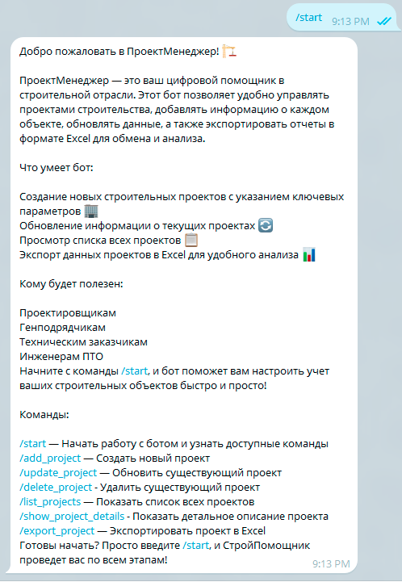

# Telegram Bot "ПроектМенеджер"

## Проблематика

В строительной отрасли взаимодействие между различными участниками проекта — проектировщиками, техническими заказчиками, генподрядчиками и инженерами-производственниками — часто осложняется из-за объемного документооборота, необходимости быстрого доступа к актуальным данным и сложностью анализа информации. Традиционные методы хранения и обмена данными, такие как бумажные документы или вручную введенные отчеты, замедляют рабочие процессы и увеличивают вероятность ошибок.

Эти проблемы ведут к увеличению затрат времени и ресурсов на согласование проектов, что в конечном итоге может задерживать сроки сдачи объектов и негативно влиять на качество выполненных работ.

## Цель работы бота

Цель разработки Telegram-бота заключается в создании удобного цифрового инструмента, который объединит участников строительных проектов и упростит их взаимодействие.

С помощью бота пользователи смогут:

-   Собирать и хранить информацию по проекту, в том числе статус выполнения работ и обновления на этапах строительства.
-   Анализировать данные за счет автоматического сбора и вывода информации в формате Excel, что позволит участникам проекта проводить регулярный анализ и делиться актуальными данными.
-   Оптимизировать отчетность и обеспечить прозрачность процессов за счет автоматического формирования отчетов, доступных для всех участников проекта.

Таким образом, бот способствует повышению эффективности и прозрачности на всех этапах проекта, улучшает коммуникацию между участниками и помогает контролировать ключевые показатели в режиме реального времени.
